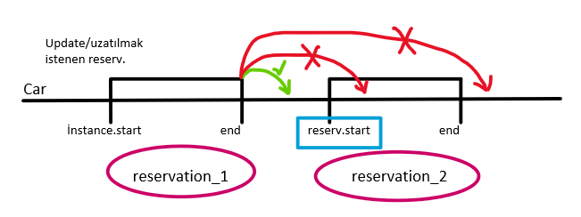

## Rent_A_Car_App

- sıfırdan yapılacak, sadece user app i başka bir projeden (flight app) alınacak, projedeki dokümanda belirtildiği gibi reservation için bir app oluşturacağız. 

```bash
- py -m venv env # python3.9 -m venv env
- .\env\Scripts\activate
- pip install djangorestframework
- django-admin startproject main .
- pip install python-decouple
- py manage.py runserver
- py manage.py migrate
- pip freeze > requirements.txt
```

- veya 
 
```bash
- py -m venv env
- .\env\Scripts\activate
- pip install -r requirements.txt
- py manage.py migrate
- py manage.py runserver
- py manage.py createsuperuser
```


- .gitignore, .env oluşturup SECRET_KEY gizliyoruz.
- INSTALLED_APPS e rest_framework ü ekliyoruz, ekliyoruz.

settings.py
```py
INSTALLED_APPS = [
    ....
    'django.contrib.staticfiles',
    # drf_package
    'rest_framework',
]
```

### user app ekleme

- Flight_App in user application' ını kopyalayıp buradaki projemize yapıştırıyoruz. 

- INSTALLED_APPS e ekliyoruz, urls paternini düzenliyoruz.

- users app imizin urls paternini incelediğimizde dj_rest_auth paketinin kullanılmış olduğunu görüyoruz, biz de projemize bu paketi yüklüyoruz ki user app imiz düzgün çalışabilsin, ayrıca INSTALLED_APPS e de ekliyoruz.

```bash
- pip install dj-rest-auth
- pip freeze > requirements.txt
```

settings.py
```py
INSTALLED_APPS = [
    ....
    'django.contrib.staticfiles',
    # third_party_packege
    'rest_framework',
    'dj_rest_auth',
    # my_apps
    'users',
]
```

- rest_framework authentication ayarlarını yapacağız;
- token tablosu ve TokenAuthentication ayarlarını ekliyoruz.

```py
INSTALLED_APPS = [
    ....
    'django.contrib.staticfiles',
    # third_party_packege
    'rest_framework',
    'dj_rest_auth',
    'rest_framework.authtoken',
    # my_apps
    'users',
]

REST_FRAMEWORK = {
    'DEFAULT_AUTHENTICATION_CLASSES': [
        'rest_framework.authentication.TokenAuthentication',
    ]
}
```

- Ayrıca main urls' e gidip user app imiz için bir path tanımlıyoruz;

main/urls.py
```py
from django.contrib import admin
from django.urls import path, include

urlpatterns = [
    path('admin/', admin.site.urls),
    path('users/', include('users.urls')),
]
```

- createsuperuser ile super user oluşturuyoruz..
- migrate ediyoruz ve runserver ediyoruz.

```bash
- py manage.py migrate
- py manage.py createsuperuser
```

- test ediyoruz,
  - register oluyoruz, 
  - token tablosunda token oluştuğunu görüyoruz, 
  - bize token döndüğünü görüyoruz.

- Login olurken, dönen data token datası içerisine, user datasının da eklenmesi için yazılmış CustomTokenSerializer için settings.py da; default TokenSerializer değil de benim yazdığım CustomTokenSerializer'ı kullan diyoruz.
  
settings.py
```py
REST_AUTH = {
    'TOKEN_SERIALIZER': 'users.serializers.CustomTokenSerializer',
}
```

- Buraya kadar bir proje başlattık ve authentication app ini de oluşturmuş olduk.

### rent_a_car_app

- Buradan sonra artık rent a car app imizi oluşturmaya başlıyoruz.

```bash
py manage.py startapp car
```

settings.py
```py
INSTALLED_APPS = [
    ....
    'django.contrib.staticfiles',
    # drf_package
    'rest_framework',
    'dj_rest_auth',
    'rest_framework.authtoken',
    # my_apps
    'users',
    'car',
]
```

- app imizin modeli oluşturalım, car tablosu, reservation tablosu olacak, bir de hazır user tablosu var onu kullanacağız.
- Car modelimizi oluşturuyoruz.
- Car modelimizde rent_per_day fieldını price/ücret için kullanacağımız için DecimalField olarak tutmamız daha mantıklı. 

car/models.py
```py
from django.db import models
from django.core.validators import MinValueValidator
from decimal import Decimal

class Car(models.Model):
    GEAR = (
        ('a', 'automatic'),
        ('m', 'manuel'),
    )
    plate_number = models.CharField(max_length=15, unique=True)
    brand = models.CharField(max_length=15)
    model = models.CharField(max_length=20)
    year = models.SmallIntegerField()
    gear = models.CharField(max_length=1, choices=GEAR)
    rent_per_day = models.DecimalField(
        max_digits=7, 
        decimal_places=2,
        validators=[MinValueValidator(Decimal(1))]
        ) # price larda decimal field kullanılır. eksi değer girilmesin diye de validator ekledik.
    availability = models.BooleanField(default=True)
    
    def __str__(self):
        return f'{self.model} - {self.brand} - {self.plate_number}'
```

- admin.py da register ediyoruz,
car/admin.py
```py
from django.contrib import admin
from .models import Car

# Register your models here.
admin.site.register(Car)
```

```bash
- py manage.py makemigrations
- py manage.py migrate
```

- admin panelde birkaç tane data girişi yapıyoruz..

- reservation modelimizi oluşturuyoruz, 
 - hangi araç, 
 - hangi kullanıcı tarafından, 
 - hangi tarih aralıklarında kiralanmış, datalarını tutacağız.

- user olarak, default user modelini kullanacağız, bu yüzden önce import ediyoruz.

car/models.py
```py
from django.contrib.auth.models import User

class Reservation(models.Model):
    customer = models.ForeignKey(User, on_delete=models.CASCADE, related_name='customers')
    car = models.ForeignKey(Car, on_delete=models.CASCADE, related_name='cars')
    start_date = models.DateField()
    end_date = models.DateField()
    
    def __str__(self):
        return f'Customer {self.customer} reserved {self.car}'
```

- admin.py da register ediyoruz,
admin.py
```py
from .models import Car, Reservation

admin.site.register(Reservation)
```

```bash
- py manage.py makemigrations
- py manage.py migrate
```

- reservation tablomuza birkaç data girişi yapıyoruz.

#### UniqueConstraint() kullanımı, modelde;
- Sınırlandırmalar
- https://docs.djangoproject.com/en/4.2/ref/models/constraints/

- Tablodaki objelerin birden fazla field'larının, tablonun diğer objeleriyle kıyaslanıp unique hale getirilmesi.
- Mesela her bir obje/instance'ın belirli üç fieldı, diğer objelerin aynı üç fieldlarına göre unique olsun. 
- Tek bir field için zaten field'ın içinden unique yapılabiliyor.

- Bu projede istenen -> Bir user, aynı tarihlerde ikinci bir araba kiralayamasın. 

- Bir kullanıcının aynı zaman içerisinde birden fazla reservation yapmasını istemiyoruz. Bir tarih aralığında, bir user a ait sadece bir kayıt olsun istiyoruz. 
- Bunu models.py da class Meta kısmında constraints ile yapıyoruz. 
 - Unique olmasını istediğimiz fieldları yazıyoruz. Ayrıca bir de name istiyor django, onu da yazıyoruz. Bu kısım dokümandan incelenebilir. 
 - Mesela burada olduğu gibi customer, start_date, end_date fieldları üçü birden unique olsun diyoruz. Ne demek bu? -> bir aynı customer aynı tarihlerde bir araç kiralayamasın.
 - Ama start_date'den bir gün sonra başka bir araç kiralayabilir.
 - Burası biraz eksik; 
   - aslından tarih aralığında kiralayamaması lazım. Bunu view de veya serrializerde algoritma kurarak kontrol etmemiz gerekiyor.
 - Aynı user yeni bir kiralama yapmak isterken, bu yeni kiralama tarihleri eski kiralama tarihlerinin aralığına düşüyor mu diye view'de kontrol yapılıp (çünkü bu tarihler params ile url'den gelecek, oradan yakalayıp) ona göre izin verilip veya verilmemesi gerekiyor.
 
 - Modelimizde böyle bir kısıtlama işlemi yaptık ama serializer'da da buradaki duruma göre, gelecek olan datanın bir validasyondan geçirilip, modeldeki bu kısıtlılık durumuna uygun olması gerekir. 
 - Eğer girilen data bu validasyondan geçemez ise bir mesaj döndürülüp kullanıcıya bildirilsin diye. 
 - Aksi halde serializerdan gelen data, modeldeki kısıtlamadan sorunsuzca geçip aynı user, aynı tarihlerde create/başka bir araç kiralayabilir.

car/models.py
```py
class Reservation(models.Model):
    ...
    ...

    class Meta:
        constraints = [
            models.UniqueConstraint(
                fields=['customer', 'start_date', 'end_date'], name='user_rent_date'
            )
        ]
```

- Test edelim, admin panelden, aynı user ile start_date, end_date aynı olan bir reservation create etmeye çalışınca bize uyarı verdi.


- modellerimizi hazırladık. Şimdi serializers larımızı oluşturacağız. İki ayrı modelimiz var ve ikisi için serializers larımızı oluşturuyoruz.

- Önce Car serializerımızı oluşturalım;

car/serializers.py
```py
from rest_framework import serializers
from .models import Car, Reservation

class CarSerializer(serializers.ModelSerializer):
    class Meta:
        model = Car
        fields = (
            'id',
            'plate_number',
            'brand',
            'model',
            'year',
            'gear',
            'rent_per_day',
            'availability',
        )
```

- bu serializer için bir view yazıyoruz;
- Burada nasıl bir view yazacağımız bize kalmış, burada kolaylığından dolayı ModelViewSet  kullanıyoruz.

- Tüm CRUD işlemleri yapılabilecek, sadece buraya bir permission tanımlayıp IsAdminOrReadOnly ile veya IsStaffOrReadOnly şeklinde Admin veya Staff olmayanlar sadece car ları görebilecekler.
- Bunun için permissions.py oluşturup custom bir permission yazacağız.


car/views.py
```py
from django.shortcuts import render
from rest_framework.viewsets import ModelViewSet
from .models import Car, Reservation
from .serializers import CarSerializer
from .permissions import IsStaffOrReadOnly

class CarView(ModelViewSet):
    queryset = Car.objects.all()
    serializer_class = CarSerializer
    permission_classes = (IsStaffOrReadOnly,)  # [IsStaffOrReadOnly]
```

- permissions.py oluşturup, custom pewrmission ımızı yazıyoruz.
  - permission'ınmızı permissions.IsAdminUser dan inherit ederek yazıyoruz,
  - has_permission() ile, genel view'in permission olarak tanımlayacağız,
  - eğer request.method SAFE_METHODS ise True dön, view'in çalışmasına izin ver,
  - değil ise (else yerine direkt return yazdık.) yani, request.method SAFE_METHODS değil ise, request.user and request.user.is_staff -> user authenticate olmuş ve staff ise view'in çalışmasına izin ver!
- 
car/permissions.py
```py
from rest_framework import permissions

class IsStaffOrReadOnly(permissions.IsAdminUser):
    
    def has_permission(self, request, view):
        if request.method in permissions.SAFE_METHODS:
            return True
        return bool(request.user and request.user.is_staff)
```

#### CarView de get_queryset() override edilmesi, url'den gelen params'ların yakalanması;

- CarView imizde, modelimizdeki available için bir override yapacağız. 
- Kullanıcı, URL'den params olarak başlangıç ve bitiş için tarih/zaman gönderecek,
- Kullanıcıdan (params olarak url'den) gelecek olan başlangıç ve bitiş için girilen zamana göre queryset imizdeki available ı ayarlayacağız.
- Get isteği ile, döneceğimiz queryset'i condition lara bağlayacağız;
  - Eğer Get isteği yapan user staff ise -> şu queryset'i dön,
  - staff değil ise -> şu queryset'i dön,
  - start_date ve end_date datası params la geldiğinde bir filtreleme yap ve bu filtrelemeye göre bir data dönsün, 

- Şimdi test edelim, kullanıcının GET ile Url'den gönderdiği params'ları alabiliyor muyuz bakalım,

- önce urls imizi ayarlayalım;

main/urls.py
```py
from django.contrib import admin
from django.urls import path, include

urlpatterns = [
    path('admin/', admin.site.urls),
    path('users/', include('users.urls')),
    path('api/', include('car.urls')),
]

```

car/urls.py
```py
from django.urls import path
from rest_framework import routers
from .views import CarView

router = routers.DefaultRouter()
router.register('car', CarView)

urlpatterns = [
]

urlpatterns += router.urls
```

- Test ettik;
  http://127.0.0.1:8000/api/car/ -> endpointine istek atınca modelimizdeki tüm instance/objec leri çekebiliyoruz,

  http://127.0.0.1:8000/api/car/?start=2024-06-20&end=2024-06-25  -> şeklinde start ve end parametrelerini gönderdiğimizde, self.request.query_params.get('start') ile alıp (query_params() bize bir dictionary dönüyor, .get() ile içinden istediğimizi alabiliyoruz), terminalde print() ederek bu parametreleri url'den alabildiğimizi de görüyoruz.

- Evet bundan sonra; 
  - Biz, staff olmayan bir user, bu parametrelerle istek attığında, bu parametler aralığında availability olan car'ları alıp, return edilmesini sağlamak istiyoruz.

- Eğer kullanıcı staff ise queryset in hepsini göster.
- Eğer kullanıcı staf değil ise ->
  - Kullanıcıdan bir start ve end date girmesi istenip, bu başlangıç ve bitiş tarihlerine göre kullacıya gösterilecek querysette değişiklik yaparak,  availability'si True olanları queryset olarak return edeceğiz. Yani kullanıcıya available/kiralamaya uygun queryset/araçları göstereceğiz.

  - frontend den gelecek olan başlangıç ve bitiş tarihlerine göre ayarlayacağımız availibility için view imizde queryset içerisinde override yapıyoruz. 
  - Bu şekilde frontend den gelecek olan start ve end i yakalayabiliyoruz.
  - http://127.0.0.1:8000/api/car/?start=2023-02-15&end=2023-02-19  yazarak terminalden yakalayıp yakalayamadığımızı kontrol ediyoruz.
  
car/view.py CarView
```py
from django.shortcuts import render
from rest_framework.viewsets import ModelViewSet
from .models import Car, Reservation
from .serializers import CarSerializer
from .permissions import IsStaffOrReadOnly

class CarView(ModelViewSet):
    queryset = Car.objects.all()
    serializer_class = CarSerializer
    permission_classes = (IsStaffOrReadOnly,)  # [IsStaffOrReadOnly]

    def get_queryset(self):
        if self.request.user.is_staff:
            queryset = super().get_queryset()
        else:
            queryset = super().get_queryset().filter(availability=True)
        start = self.request.query_params.get('start')
        # print(start)
        end = self.request.query_params.get('end')
        # print(end)
        
        return queryset
```

- evet yakalayabiliyoruz. Kullanıcının girdiği start ve end datalarını yakaladık, şimdi logic imizi kuracağız. 

- Burada yani backend de bu tarihlerle ilgili validation yapmaya gerek yok, bunu frontend de yapabiliriz. Yani start için bugünden önceki bir tarihi seçme, end için start tan önceki bir tarihi seçme gibi gibi..

- kullanıcının girdiği tarihlere göre sadece available olan araçları ona göstermek için kuracağımız logic -> 

#### tarihlere göre available olan araçlar için logic;

- Önce available olmayan car ları belirleyeceğiz, daha sonra available olan car ları göstereceğiz. gidiş yolumuz bu olacak, tersini de yapabiliriz.

##### Q objesi ile complex sorgular kullanımı; 
##### bitwise operator kullanımı;
- Q objesi ile complex sorgular kullanımı;
  https://docs.djangoproject.com/en/5.0/topics/db/queries/#complex-lookups-with-q-objects

- Q ile tanımlarsak, işlemleri bitwise operatorlerle yapıyoruz.
     https://www.w3schools.com/js/js_bitwise.asp

- Genelde OR(|) işlemlerinde kullanıyoruz. Çünkü, and kullanmadan ',' virgül ile condition ları 'and' şeklinde kullanabiliyoruz. Ancak 'OR' condition'ları için böyle yapamıyoruz, onun yerine Q kullanıp, bitwise operatör ile cond1 | cond2 olarak yazıp 'OR' kullanabiliyoruz.
```py
  not_available = Reservation.objects.filter(
                 start_date__lt=end, end_date__gt=start
                 )

cond1 = Q(start_date__lt=end) 
cond2 = Q(end_date__gt=start)            
  not_available = Reservation.objects.filter(
                cond1 | cond2
                ) 
```

##### available olmayanları bulup, queryset'ten çıkarma;

- Burada condition (durum) belirleyeceğiz, bunu da Q ile yapacağız;
  - Önce djngo.db.models den Q'yu import ederek,
  - cond1 = Q(start_date__lt=end) 
  - cond2 = Q(end_date__gt=start) 
  - şeklinde iki tane condition (durum) belirliyoruz. Yani;
    - cond1, başlangıç tarihi kullanıcının girdiği end tarihinden küçük olacak,
         cond1 = Q(start_date__lt=end)

    - cond2, bitiş tarihi kullanıcının girdiği start tarihinden büyük olacak.
         cond2 = Q(end_date__gt=start)

  - Bu iki condition ile,  not_available isminde bir değişken tanımlayıp, Reservation tablosu içerisinden bu iki condition ı sağlayan instance ları (objeleri) bu değişkene tanımlıyoruz. 
        not_available = Reservation.objects.filter(
                cond1 & cond2
                )

  - Ayrıca bunu yaparken de birden fazla instance/obje olacağı için bunu da bize liste olarak versin values_list() ve de bu instance/obje lerin sadece id lerini ('car_id') versin, ayrıca  diye de ekliyoruz.
        not_available = Reservation.objects.filter(
                cond1 & cond2
                ).values_list('car_id', flat=True) # [1,2]

  - Daha sonra yukarıda bulduğumuz not_available olan car'ları queryset içinden çıkar/exclude et ->
      queryset = queryset.exclude(id__in=not_available)

  - queryset'i return et!

```py
# cond1 ve cond2 ye göre Reservation object'lerini filtrele, values'lerinden 'car_id' lerini liste halinde ver! 
cond1 = Q(start_date__lt=end) 
cond2 = Q(end_date__gt=start)
not_available = Reservation.objects.filter(
    cond1 & cond2
    ).values_list('car_id', flat=True) # [1,2]
```


  - Artık biz frontend den kullanıcının start ve end için girdiği tarihlere göre available olmayan yani not_available olan car ların id lerini tespit edebildik.
  - Bundan sonra kullanıcıya döndüğümüz queryseti tekrar tanımlayarak, queryset içerisinden bu not_available değişkeninin içinde id leri olan car ları çıkararak (exclude) availability si True olan araçları gösterebiliriz.   

```py
queryset = queryset.exclude(id__in=not_available)
```

  - Artık querysetimizi, kullanıcıya girmiş olduğu start ve end tarihleri arasındaki available olan car ları gösterecek şekilde ayarladık. (exclude -> bunları çıkar, filter -> bunları getir)

- En son olarak, eğer bize Get isteği ile gelen endpoint imizde bir sorgu yoksa yani start ve end yoksa bize hata dönüyor. Bunun önüne geçmek için if condition yazıp, kodlarımızı da içerisinde alarak, eğer url'de ?'den sonra parametre olarak start veya end None değil ise yani parametre girilmiş ise girilen start ve end parametrelerine göre oluşturulan query seti dön, 
- değil ise yani start veya end None ise normal querysetini dön!

car/views.py
```py
from django.db.models import Q

        if start is not None or end is not None:

            cond1 = Q(start_date__lt=end) 
            cond2 = Q(end_date__gt=start)
            # veya;
            # not_available = Reservation.objects.filter(
            #     start_date__lt=end, end_date__gt=start
            #     ).values_list('car_id', flat=True) # [1,2]
            
            # veya;
            # not_available = Reservation.objects.filter(
            #     Q(start_date__lt=end) & Q(end_date__gt=start)
            #     ).values_list('car_id', flat=True) # [1,2]


            # Static available field:
            # cond1 ve cond2 ye göre Reservation object'lerini filtrele, values'lerinden 'car_id' lerini liste halinde ver! 
            not_available = Reservation.objects.filter(
                cond1 & cond2
                ).values_list('car_id', flat=True) # [1,2]
            # print(not_available)
        
            # not_available içindeki car ların id'leri, queryset içindeki id'lere eşit olanları, queryset'ten çıkar/exclude et!
            queryset = queryset.exclude(id__in=not_available)
            
        return queryset
```

- eğer start, end sorgusu varsa buna göre oluşturduğu queryset, yoksa queryset dönüyor. Normalde frontend de bunu göstermeyeceğimiz için bu if condition a gerek yok ama şimdi oluşturma aşamasında her seferinde sorgu yapmamak için bu if condition ı yazdık.

- Test ediyoruz, üç aracımız var ve ikisini peşi sıra reservation ekliyoruz. Kullanıcı ;
  http://127.0.0.1:8000/api/car/?start=2023-09-30&end=2023-10-03  
şeklinde bir start ve end date girince başlangıç ve bitiş tarihleri itibariyle sadece müsait olan car gösteriliyor ona.

- Burada biz önce available olmayanları bulup, onları queryset ten çıkararak ilerledik. Ancak available olanlar bulunup queryset içerisinden çağırılarak da devam edilebilir. 

##### available olanları bulup, queryset'ten çağırma;
##### Dinamik available;
- Dinamik available nasıl oluşturulur onu göreceğiz. 
- Yani tek bir car değil üç car gösterilecek, 
- biz is_available diye bir field oluşturacağız, 
- eğer kullanıcının girdiği tarihte available ise True dönecek 
- değilse False dönecek. 
- Üç car da dönecek, frontend de ie field ın değerine göre disable olarak gösterilebilir.

- aracın availability durumunu sadece staff userlar görsün istiyoruz.
  - Bunun için rollere göre serializer yazabiliriz.(daha önceki bir projede yapmıştık. 
  - staff ise şu serializer çalışsın, 
  - normal user ise başka serializer çalışsın.) Python bunu tavsiye ediyor.
  - Ancak tek bir field görünmesin istiyorsak ayrı bir serializer yazmaya gerek yok. 
  - Fakat o field ın içinde şunlar da olsun (nested fields) diyorsak yeni bir serializer yazmalıyız.
  
##### 1. Yol, bu projede bunu kullanacağız;
  - Bu projede 1.Yolu kullanacağız.;
    - ModelSerializer ın get_fields() methodu var bunu override edeceğiz. Bu method serializer daki fieldların isimlerini döndüren bir method. Bu fieldları istediğimiz gibi saklayabiliriz. Bu method (aradaki işlemlere takılmayın) en son serializer da yazdığımız fieldları response olarak view imizde dönüyor. 
    - Burada fieldların dönüş şeklini rollere bağlayabiliriz. 
    - user staff ise tüm fieldlar response olarak dönsün, 
    - normal user ise şu fieldlar dönsün!

car/serializers.py

```py
class CarSerializer(serializers.ModelSerializer):
    class Meta:
        ...

    # Bu method u override etmek yerine staff ve normal userlar için ayrı ayrı serializerlar oluşturulup
    # View de get_serializer_class methode u override edilerek user a göre serializerlar seçilebilir.
    def get_fields(self):
        fields = super().get_fields() # superindeki tüm fieldları al
        request = self.context.get('request') # context içindeki request i al. O anki user bilgisi requestin içinde var.
        if request.user and not request.user.is_staff: # user var ve o user staff değil ise:
            fields.pop('availability') # availability field ını çıkar
            fields.pop('plate_number') # plate_number field ını çıkar
        return fields  # if bloğuna girmezse tüm fieldları dön. user var ve o user staff ise superdeki tüm fieldları dön. 
```

- Test ediyoruz, anonymous bir user ile,
  http://127.0.0.1:8000/api/car/

  http://127.0.0.1:8000/api/car/?start=2024-06-10&end=2024-06-16

  endpointlerine Get isteği attığımızda 'availability' ve 'plate_number' fieldlarının gelmediğini görüyoruz.
- Ancak staff user ile istek attığımızda 'availability' ve 'plate_number' fieldlarının da geldiğini görüyoruz.


##### 2. Yol, alternatif -> Bir serializer yazıp, view de get_serializer_class() methodundaki conditiona göre seçim yaptırmak;

   - Normal ve anonymous userlar için 'availability' ve 'plate_number' fieldlarının olmadığı bir serializer yazarız,
   - staff userlar için ise 'availability' ve 'plate_number' fieldlarının olduğu bir serializer yazarız,
   - view'de get_serializer_class() methodunu override ederek;
   - eğer user staff ise CarStuffSerializer'ı kullan,
   - değil, user normal veya anonymous ise CarSerializer'ı kullan deriz.

car/serializers.py
```py
from rest_framework import serializers
from .models import Car

# 2. Yol;
class CarStuffSerializer(serializers.ModelSerializer):
    class Meta:
        model = Car
        fields = (
            'id',
            'plate_number',
            'brand',
            'model',
            'year',
            'gear',
            'rent_per_day',
            'availability',
        )

class CarSerializer(serializers.ModelSerializer):
    class Meta:
        model = Car
        fields = (
            'id',
            'brand',
            'model',
            'year',
            'gear',
            'rent_per_day',
        )
```

car/views.py
```py
class CarView(ModelViewSet):
    queryset = Car.objects.all()
    serializer_class = CarSerializer
    permission_classes = (IsStaffOrReadOnly,)  # [IsStaffOrReadOnly]

    ...
    ...
    
    # 2. Yol;
    def get_serializer_class(self):
        from .serializers import CarStuffSerializer, CarSerializer
        if self.request.user.is_staff:
            return CarStuffSerializer
        else:
            return CarSerializer 
```

- Biz bu projede 1. Yolu kullandık.

##### Reservation;

- Şimdi Reservation modelimiz için serializerımızı oluşturalım, ardından viewimizi yazalım;

car/serializers.py ->
```py
class ReservationSerializer(serializers.ModelSerializer):
    
    class Meta:
        model = Reservation
        fields = (
            'id',
            'customer',
            'car',
            'start_date',
            'end_date',
        )
    
        # Modeldeki kısıtlamanın hata/crash vermemesi için; 
        validators = [
            serializers.UniqueTogetherValidator(
                queryset=Reservation.objects.all(),
                fields=('customer', 'start_date', 'end_date',),
                message=('You already have a reservation between these dates...')
            )
        ]
```
- Modelimizde constraints ile bir kısıtlama işlemi yapmıştık. ('customer', 'start_date', 'end_date' fieldları aynı olamaz!)
- serializer'da da buradaki duruma göre, gelecek olan datanın bir validasyondan geçirilip, modeldeki bu kısıtlılık durumuna uygun olması gerekir. 
- Eğer girilen data bu validasyondan geçemez ise bir mesaj döndürülüp kullanıcıya bildirilsin diye. 
- Aksi halde serializerdan gelen data, modeldeki kısıtlamada takılırsa hata/crash oluşur.  

- validators ekliyoruz ki bir kullanıcı başlangıç ve bitiş tarihleri aynı olan birden fazla reservation yapamasın. Bu sayede daha db ye gitmeden serializer da engelliyoruz. Yapmaya çalışırsa da bir uyarı mesajıyla bunu bildiriyoruz.


- ReservationSerializer ımızı yazdık. Şimdi bunu kullanacak viewimizi yazalım.
- Bu sefer generics viewslerden ListCreateAPIView ve RetrieveUpdateDestroyAPIView i kullanacağız. 
- Detail gerektirmeyen işlemler bir view altnda (ListCreateAPIView), 
- Detail gerektiren işlemler bir view altnda toplanmıştı (RetrieveUpdateDestroyAPIView).

car/views.py ->
```py
from rest_framework.generics import ListCreateAPIView, RetrieveUpdateDestroyAPIView
from .serializers import ReservationSerializer

class ReservationView(ListCreateAPIView):
    queryset = Reservation.objects.all()
    serializer_class = ReservationSerializer
```

- Bu viewimize bir de endpoint tanımlayalım, bu viewimiz model view set MVS olmadığı için router ile değil de normal path yazıyoruz 

car/urls.py ->
```py
from .views import ReservationView

urlpatterns = [
    path('reservation/', ReservationView.as_view()),
]
```

- endpointimizi bir test edelim, 
  http://127.0.0.1:8000/api/reservation/   
  endpointine istek atıyoruz, 

  - serializerdaki validator ü yoruma alıp denediğimizde;
    "non_field_errors": [
        "The fields customer, start_date, end_date must make a unique set."
    ]

  - serializerdaki validator ü devreye alıp denediğimizde;
    "non_field_errors": [
        "You already have a reservation between these dates..."
    ]

    Hata mesajlarını dönüyor.

  -  bir kullanıcının aynı tarihlerde birden fazla reservation yapabilmesi engelleniyor.

- Eğer user'ın reservation yapmak istediği tarih ile kesişen bir reservasyonu var ise, 
- create() methodu override edilerek,
- measaj dön ve yeni bir reservation create etmesine mani ol!

- Şimdi viewimize permission tanımlayalım. kullanıcı authenticate ise reservation yapabilsin, değil ise login sayfasına yönlendireceğiz...

- Ayrıca user staff ise, tüm reservation ları görsün, user staff değil ise sadece authenticate olmuş bir user ise sadece kendi reservation larını görsün diye get_queryset() methodunu override ediyoruz. (eğer user staff ise tüm queryseti(tüm reservations ları), değil ise customer ı yani user ı, istek atan user ile aynı olan objeleri/instanceları/reservationsları queryset içinden filtreleyerek getir!)

```py
from rest_framework.permissions import IsAuthenticated

class ReservationView(ListCreateAPIView):
    ...
    ...
    permission_classes = (IsAuthenticated,)

    def get_queryset(self):
        if self.request.user.is_staff:
            return super().get_queryset()
        return super().get_queryset().filter(customer=self.request.user)
```

- Test ediyoruz ve staff token ı ile istek attığımızda tüm reservationslar dönüyor, başka bir authenticate olmuş user ile istek attığımızda sadece istek atan authenticate olmuş user ın reservations ları dönüyor.

##### total_price hesaplatma (serializer'da, MethodField ile);
- Buraya user ın yapmış olduğu reservations ların total_price ını da ekleyebiliriz;
- Bunu serializerda method field yazarak yapabiliriz.

```py
class ReservationSerializer(serializers.ModelSerializer):
    
    total_price = serializers.SerializerMethodField(method_name='toplam') # method name tanımlanırsa aşağıda o isimle çağırabiliriz, tanımlamaz isek def get_total_price() olarak çağırmamız gerekir.
    # total_prize = serializers.SerializerMethodField()

    class Meta:
        ...
        fields = (
            '...',
            'total_price',
        )
    
    def toplam(self, obj):
        return obj.car.rent_per_day * (obj.end_date - obj.start_date).days
    # def get_total_price(self, obj):
    #     return obj.car.rent_per_day * (obj.end_date - obj.start_date).days  

```

- Test ediyoruz, 
  http://127.0.0.1:8000/api/reservation/
  endpointine authenticate olmuş userın tokenı ile istek atıyoruz, bize o userın reservations bilgileri ile birlikte total price ını da veriyor.


##### reservation update;
- Projenin isterleri arasındaki user kiraladığı aracın end date ini uzatabilsin, bunu yaparken de uzattığı tarih başka bir reservation ile çakışıyor mu bunun kontrolü yapılsın...

- Adım adım gidelim,
- end_date uzatmak istiyor mu -> evet/hayır
- evet -> uzatmak istediği tarih, kontrol etmemiz lazım, nerede reservation da.
- Bu car'a ait başka bir reservation var mı? 
- Varsa tarih aralığı uzatılmak istenen tarih aralığında mı?
- kontrolünü yap.

- Reservation modelimizin listeleme ve create etme için view imizi yazdık, şimdi detail gerektiren işlemleri olan detail, delete, update için viewimizi yazalım. concrete viewlerden RetrieveUpdateDestroyAPIView i kullanıyoruz.
- Bu viewde dikkat edeceğimiz husus; update ederken sadece end_date fieldını update edebilmesi olacak. start_date update edemeyecek. Eğer start_date update etmek isterse komple reservationı silsin, sonra yeniden start ve end belirleyip reservation yapsın.

- Bu hususu frontend'de halledilecek. 
  - Frontend' de PATCH methoduyla sadece end_date datasını gönderip update edebiliriz.
  - veya Frontend' de kullanıcıya kutucuk olarak sadece end_date'i update ettirip tüm datayı PUT meyhodula gönderip update edebiliriz.

- Tabi end_date i uzatmak isterse bizim bunu başka reservationlarla çakışıp çakışmadığının kontrolünü yapmamız gerekir. 
- Bunun için def update() methodunu overrid etmemiz gerekiyor. source koda gidip def update() i alıyoruz,
- data validate'ten geçtikten sonra; 

- 1- bu valid data içerisinden, uzatmak istediğimiz, end_date datasını alıyoruz ve end değişkenine tanımlıyoruz,
- 2- car'ı çekiyoruz,
- 3- update/uzatmak istediğimiz reservation'ın start_date'i çekiyoruz,
- 4- Eğer Reservation tablosunda car=car olan bir reservation varsa (exist())
- 5- for ile ilgili car'ın reservation'ları içinde dönüyoruz,
- 6- if condition:
       update/uzatmak istediğimiz reservation'ın start_date'i < car'ın reservation'larının start_date'i < update/uzatmak istediğimiz reservation'ın end_date'i
       True dönerse eğer, demekki -> uzatmak istediğimiz bitiş tarihi başka bir reservation'a denk geliyor. Mesajla/Response bu car müsait değil mesajı.
     Eğer denk gelmiyorsa super().update() -> superdeki update methodunu çalıştır ve update/uzatmak istediğimiz reservation'ın end_date'ini update et.   



car/views.py
```py
from rest_framework.response import Response

class ReservationDetailView(RetrieveUpdateDestroyAPIView):
    queryset = Reservation.objects.all()
    serializer_class = ReservationSerializer

    def update(self, request, *args, **kwargs):
        partial = kwargs.pop('partial', False)
        instance = self.get_object()
        serializer = self.get_serializer(instance, data=request.data, partial=partial)
        # validse datayı dön, değilse hataları/errorları raise et.
        serializer.is_valid(raise_exception=True)
        
        end = serializer.validated_data.get('end_date')
        car = serializer.validated_data.get('car')
        start = instance.start_date # update edilecek instanceın start_date i

        if Reservation.objects.filter(car=car).exists(): # Bu car a ait reservation var mı?
            for reserv in Reservation.objects.filter(car=car):
                if start < reserv.start_date < end:
                    return Response({'message': 'Car is not available...'}) # eğer if bloğuna girerse burasını return et. (update yapma mesajı döndür!)

        return super().update(request, *args, **kwargs) # eğer if bloğuna girmezse burasını return et. (Normal olarak update yap!)
```

- yazdığımız view imizin endpointini oluşturalım;

car/urls.py
```py
urlpatterns = [
    path('reservation/', ReservationView.as_view()),
    # path('reservation/<int:id>', ReservationDetailView.as_view()),
    path('reservation/<int:pk>', ReservationDetailView.as_view()),
]
```

- Test ediyoruz; 
  http://127.0.0.1:8000/api/reservation/1
endpointine istek atıyoruz, Burada sadece end_date field ı için değişikliğe izin vereceğiz. 

- Bunun için frontend de sadece method 'PATCH' olarak belirtilip, end_date gönderilip, update yaptırılabilir. Veya kutucuk olarak kullanıcıya sadece end_date i değiştirttirip tüm datayı 'PUT' methodu ile de göndertebiliriz.

- reservationı uzatmak istediğimiz tarih, aynı aracın başka bir reservation aralığına veya sonrasına denk geliyorsa izin vermiyor. 


##### update ederken, arabanın geçmiş tarihli reservation tarihlerini hesaba katmasın.
- Update ederken arabanın geçmiş tarihli reservations larının tarihlerini hesaba katmasın.

```py
from django.utils import timezone

class ReservationDetailView(RetrieveUpdateDestroyAPIView):
    ...

    def update(self, request, *args, **kwargs):
        ...
        today = timezone.now().date()

        if Reservation.objects.filter(car=car).exists():
            # a = Reservation.objects.filter(car=car, end_date__gte=today)
            # print(len(a))    

            for reserv in Reservation.objects.filter(car=car, end_date__gte=today):
```

- Update etmek istediğimiz reservation'a ait car'a geçmiş tarihli bir reservation create edip, bize gösteriyor mu onu test edelim;
- a'nın uzunluğunun 2 olmasını bekliyoruz, çünkü end_date'i bugünden sonrası için 2 tane reservation var, bugünden öncesine ait 1 tane  reservation var.
- Evet, çalıştı. Bir update işlemi yaptığımızda, terminalde, a'nın uzunluğu 2 geldi. Demek oluyor ki car'a ait 3 reservation'dan 1'inin end_date'i bugün veya daha öncesine ait.


#### Dinamik is_available field nasıl yapılır

- Car tablosundan start ve end tarihleri girilerek yapılan istekte, Tüm araçlar dönsün. Girilen tarihler aralığında;
  - reservasyonu olan araçlar is_available=False, 
  - reservasyonu olmayan araçlar is_available=True dönsün istiyoruz. 
  
- Dinamik bir is_available field ı nasıl yapılır? Bu niçin yapılır?
- sayfada bütün car lar görülsün ama reserve edilebilenler active olsun, diğerleri deactive görünsün.
- Annotate (açıklama ekleme) field üretme; db deki kayıtlı fieldlar kullanılarak onlardan yeni bir field üretme. 
- Bunu serializer da yapıyoruz, CarSerializer a gidip is_available isminde boolean bir field oluşturup default olarak True diyoruz. Çünkü anonymouse userlar ilk etapta Get ile car'ları sadece listelerken url'den start ve end parametreleri göndermeyeceği için is_available field'ı viewde yazılacak condition'a göre doldurulmayacağı için default olarak True tanımlıyoruz ki bize bu field'ı doldurmadın hatası vermesin.

car/serializers.py
```py
class CarSerializer(serializers.ModelSerializer):
    is_available = serializers.BooleanField(
        default=True # anonymous userlar için..
        )
    
    class Meta:
        model = Car
        fields = (
            ...
            'is_available',
        )
```

- get_fields(self) methodunda

- daha sonra views.py a gidip; CarSerializer'ı çalıştıran viewimizde queryset olarak kullandığımız CarSerializer'daki is_available boolean field'ına annotate fonksiyonuyla değer (1 veya 0, True or False) tanımlayacağız. 
- queryset.annotate() methodu ile, queryset'teki is_available boolean field'ı şu şekilde tanımla;

  - Annotate te kullanacağımız method olan Exists'i django.db.models den Exists import ediyoruz, (Birşey var mı yok mu onu kontrol için kullanılıyor.Sum toplamını hesaplar gibi)
    - Reservation tablosunu filtreleyerek,
      - Url'den gelen tarihlerle, yukarıda logic'i kurulan static not_available field'ındaki koşullara ilave olarak, 
      - Q(car=OuterRef('pk')) conditionu eklenerek (Buradaki OuterRef() ile bir üst modeldeki pk'leri eşleştir, OuterRef()'i bir üst tabloda işlem yapmak için kullanıyoruz, 
        - yani Reservation tablosundaki bu pk, Car tablosunda exists ise bu condition True olsun)
      - Tamam bu kodla not_available olan carları buluyorduk, yani not_available=True. 
      - Fakat biz bu bulduklarımızın is_available=False  olarak tanımlanmasını istiyorduk. Bunun için de eşittirden sonra tilde işareti (djangoda yapılan işlemi tam tersine çevir demek) koyarak False yapıyoruz. ;
        - is_available =~ Exist(Reservation.obj....)

- En nihayetinde Reservation tablosundaki şu conditionları sağlayan bir üst Car tablomuzdaki pk'ler exists ise, bunları True yap, ama tilde işareti ile de False yap. Yani available olmayanları False yap, geri kalanlar da otomatik False'un tersi True olacak.


car/views.py
```py
from django.db.models import Exists, OuterRef

class CarView(ModelViewSet):
    ...

    def get_queryset(self):
        ...
        ...
        #! Dinamic is_available field:
            queryset = queryset.annotate(
                is_available=~Exists(Reservation.objects.filter(
                    Q(car=OuterRef('pk')) & cond1 & cond2 # Bir üst modeldeki pk leri eşleştir ve cond1 ve cond 2'yi eşleştir.
                ))       
            )
        return queryset
```


### pythonanywhere deployment

- Projeyi github a push layın. reponun görünürlüğünü Public olarak ayarlayın. (push larken dbsqlite3'yi de pushluyorum. Db boş olmasın diye.)
- pythonanywhere sign up oluyoruz.
- pythonanywhere free account içinde sadece 1 app konulabiliyor. Birden çok app konulacaksa, birden fazla e-mail ile birden fazla free account oluşturulup ve herbir free account a 1 app konulabilir.
- pythonanywhere default olarak olarak sql3 db sunuyor. free account ta postgresql için para ödemek gerekiyor.
  
- repoda bir değişiklik olduğunda deploy edilmiş app a değişiklikler otomatik yansımıyor. (pipline) Değişiklikleri repoya pushladıktan sonra, pythonanywhere e gidip, terminalden yapılan değişiklikler tekrardan çekilip!!, app i reload etmek gerekiyor.

- pythonanywhere -> dashboard -> New console -> $Bash yeni sekmede açıyoruz.
- pythonanywhere deki bash terminalde;
- rm -rf ....   ile eskilerini siliyoruz. (README.txt kalıyor.)
```bash
rm -rf klkf.txt
```

- github taki deploye edeceğimiz reponun url ini kopyalıyoruz (clonelar gibi)
- pythonanywhere deki bash terminale;

```bash
git clone https://github.com/Umit8098/Project_Django_Rest_Framework_Rent_A_Car_App_CH-12.git
```

- project imizi pythonanywhere clonladık.
- terminalde ls komutuyla dosyaları görüyoruz,
- projemizin içine, manage.py dosyasıyla aynı seviyeye geliyoruz (cd komutuyla), yani ls komutunu çalıştırdığımızda manage.py ı görmemiz lazım.

- Türkiyede cloud platformlar çok kullanılmıyor, genelde Dedicated Server lar üzerinden işlemler yapılıyor. Tüm proje o server içerisinde oluyor. Servera girip, projeyi clonlama işlemi yapılıyor, veya pipeline kuruluyor (localde bir değişiklik yapıldı, github a pushlandı, merge oldu, development server ından bu değişikliğin algılanıp canlıda değişiklik yapılması...). Bunun için github hook ları var, bu hooklar ile işlem yapılıyor.  Bir değişiklik olduğunda github hookları takip ediliyor, değişiklik olduğunda trigger ediyor, o trigger ile server ınızda otomatik git pull yapıyor, değişiklikleri çekiyor, projeyi yeni şekliyle ayağa kaldırıyor.

- Localde iken yapmamız gereken işlemlerin aynısını yapıyoruz;
    - virtual environment oluşturuyoruz,
    - bazı eski versiyonlarda python 2. versiyonu gelebiliyor. Önce "python --version" ile kontrol edilip, eğer 2. versiyon geliyorsa "python3 --version" ile bir daha kontrol edip bu sefer 3. versiyonun geldiğini görüp, "python3 -m venv env" ile virtual environment oluşturuyoruz.
    - "source env/bin/activate" komutu ile env yi aktif hale getiriyoruz.(Bu ortam linux ortamı olduğu için windows kullanıcıları da ancak bu komutla env aktif hale getirebilir.)
    - projenin dependency lerini (bağımlılıklarını) kuruyoruz.

```bash
- python --version
- python3 --version
- python3 -m venv env  # python -m venv env 
- source env/bin/activate
- pip install -r requirements.txt
```

  - pythonanywhere -> dashboard -> Web -> Add a new web app -> next -> Manual configuration (including virtualenvs) -> Python 3.10 (kurulu python versionu) -> next
        All done! Your web app is now set up. Details below. 
        (Hepsi tamam! Web uygulamanız artık kuruldu. Detaylar aşağıda.)
  - Artık app kuruldu ve app ile ilgili bir dashboard sundu bize. Burada manuel configurations lar yapacağız. 
        Bu site 28 Temmuz 2024 Pazar günü devre dışı bırakılacaktır. Buradan 3 ay daha app i çalıştırmak için bir button var.

- Şimdi yapacağımız işlemler -> 
  - Code:
        Source code: -> source codumuzu koyduğumuz yeri yazacağız.
        Working directory: -> source code ile aynı oluyor, bu directory de çalışacaksın diyoruz.  
        WSGI configuration file: -> manuel olarak update edeceğiz.
  - Virtualenv:
        Enter path to a virtualenv, if desired -> env nin nerede olduğunu göstereceğiz, yolunu vereceğiz.


- Source code: -> bash terminalde app in olduğu klasör içerisinde iken, "pwd" yazıp klasörün yolunu görebiliyoruz.
        /home/umit8104/Project_Django_Rest_Framework_Rent_A_Car_App_CH-12
- Working directory: -> Source code kısmına yazdığımız yolu buraya da yazıyoruz.
        /home/umit8104/Project_Django_Rest_Framework_Rent_A_Car_App_CH-12
- WSGI configuration file: Manuel configuration yaptığımız için bu WSGY (Web Server Gateway Interface) configuration u da kendimiz yapacağız. django application ile server arasındaki iletişimi sağlayan gateway. Bunda ayarlar yapmalıyız. sağ tıklayıp new tab ile yeni pencerede açıyoruz, Default olarak farmeworklerin ayar template leri var. 74-89 satırları arasında django kısmı var. Bunun haricindeki herşeyi siliyoruz, sadece django ile ilgili kısım kalıyor. İlk iki satır hariç yorumdan kurtarıyoruz.

```py
# +++++++++++ DJANGO +++++++++++
# To use your own django app use code like this:
import os
import sys

# assuming your django settings file is at '/home/umit8098/mysite/mysite/settings.py'
# and your manage.py is is at '/home/umit8098/mysite/manage.py'
path = '/home/umit8098/mysite'
if path not in sys.path:
    sys.path.append(path)

os.environ['DJANGO_SETTINGS_MODULE'] = 'mysite.settings'

# then:
from django.core.wsgi import get_wsgi_application
application = get_wsgi_application()

```

- path kısmında bize manage.py ın yolunu vermemizi istiyor. Aslında source code umuzun olduğu path, biraz önce "pwd" ile almıştık, "/home/umit8103/Project_Django_Rest_Framework_Stock_App_CH-13". Bunu path değişkenine tanımlıyoruz. Yani manage.py ımız bu klasörün içinde bunu söylüyoruz.

```py
path = '/home/umit8104/Project_Django_Rest_Framework_Rent_A_Car_App_CH-12'
```

- os.environ['DJANGO_SETTINGS_MODULE'] = 'mysite.settings'  -> settings klasörümüzün bulunduğu yeri belirtiyoruz. Bizim settings klasörümüz core in altında. buraya 'core.settings' yazıyoruz.

```py
os.environ['DJANGO_SETTINGS_MODULE'] = 'main.settings'
```


- save ediyoruz.

- Virtualenv: env yolunu vermemiz lazım. Tekrar console a geri dönüyoruz, 
  - env nin olduğu dizne gidiyoruz. (ls yaptığımızda env yi görüyoruz.) 
  - "cd env/" ile env nin dizinine giriyoruz. 
  - pwd yazıp env nin path'ini yani yolunu kopyalıyoruz.
  - kopyaladığımız path i Virtualenv kısmındaki bölüme yazıp tik e tıklıyoruz. env miz de hazır.

```py
/home/umit8104/Project_Django_Rest_Framework_Rent_A_Car_App_CH-12/env
```


- Genel olarak ayarlarımız tamam ama birkaç ayar daha kaldı.
  - SECRET_KEY, DEBUG, ENV_NAME, DJANGO_LOG_LEVEL=INFO (bu projeye özel)
  - Bunları ayarlayacağımız yer Source code kısmındaki Go to directory. sağ tıklayarak yeni sekmede açıyoruz,
  - projemizde bu verileri tuttuğumuz yer .env file ı idi. Açılan sekmede Files kısmına .env yazıp New File oluşturuyoruz. bize .env isminde yeni bir file oluşturdu. manage.py, requirements.txt ile aynı seviyede.
  - Eğer dev, prod şeklinde env mizi ayırmadıysak sadece .env deki değişkenleri tanımlamamız yeterli.
  - Ancak env miz dev ve prod olarak ayrılmış ise -> 
    - SECRET_KEY tanımladık, 
    - DEBUG=True  (Önce True yazıyoruz, hataları görebilmek için. daha sonra False a çekebiliriz.)
    - settings klasörünün __init__.py daki env değişkeninin ismine ne verdiysek onu alıp .env file ında değişken ismi olarak kullanıyoruz. ENV_NAME
    - ENV_NAME=development  
        - prod ayarlarımızda db olarak postgresql var. bizim dev ayarlarını kullanmamız daha iyi. 
        - Ayrıca dev ayarlarını kullanırken de; debug.toolbar sadece localhost ta çalışıyor. Bu yüzden debug.toolbar ayarları ile development çalıştırılırsa hata verecektir. Bu hatayı almamak için dev.py daki debug.toolbar ayarlarını yoruma alıyoruz.
    - Bir de DJANGO_LOG_LEVEL=INFO ayarımız vardı onu da .env file ımıza ekliyoruz.

settings/dev.py
```py
from .base import *

# THIRD_PARTY_APPS = ["debug_toolbar"]

DEBUG = config("DEBUG")

# INSTALLED_APPS += THIRD_PARTY_APPS

# THIRD_PARTY_MIDDLEWARE = ["debug_toolbar.middleware.DebugToolbarMiddleware"]

# MIDDLEWARE += THIRD_PARTY_MIDDLEWARE

# Database
# https://docs.djangoproject.com/en/4.0/ref/settings/#databases
DATABASES = {
    "default": {
        "ENGINE": "django.db.backends.sqlite3",
        "NAME": BASE_DIR / "db.sqlite3",
    }
}

# INTERNAL_IPS = [
#     "127.0.0.1",
# ]
```


- .env dosyamızın en son hali -> 

.env
```py
SECRET_KEY=o_zoo)sc$ef3bbctpryhi7pz!i)@)%s!ffg_zsxd^n+z+h5=7i
DEBUG=True
ENV_NAME=development
DJANGO_LOG_LEVEL=INFO
```

- bash console a gidip db mizdeki tablolarımız oluşturacağız.
- (Biz projemizi github'a pushlarken db.sqlite3' yi de pushlamıştık. Yani db miz var. Eğer db'siz olarak github'a pushlayıp, oradan pythonanywhere'e deploye ediyorsak o zaman migrate ve superuser yapmamız gerekiyor.) 
- bash console da manage.py file ının bulunduğu dizine gidip db miz deki tablolarımızı oluşturuyoruz, superuser oluşturuyoruz,

```bash
python manage.py migrate
python manage.py createsuperuser
```

- dashboard a gidip Reload butonuna tıklıyoruz. Tüm değişiklikleri algılayacaktır. Daha sonra hemen bir üstte verdiği link ile projemizi pythonanywhere de yeni sekmede çalıştırıyoruz. 
- Bazen ALLOWED_HOSTS hatası veriyor. pythonanywher'e yüklediğimiz projenin settings.py'ına gidip ALLOWED_HOSTS = ['*'] şeklinde update/save ediyoruz ve tekrardan reload ediyoruz.
- admin panele giriyoruz,
- statics ler olmadan, css ler olmadan sayfamız geldi. 
- statics lerin görünmemesinin sebebi; django admin panel bir application ve bunun static file ları env içerisinde duruyor. Bunu localhost ta çalıştırdığımız zaman sıkıntı yaşamıyoruz ama canlı servera aldığımız zaman static root diye bir directory belirtmemiz gerekiyor. Static root, bütün environment ta olan static file ları veya application içerisinde varsa static file larımızı (css, javascript, image)  bunların hepsini tek bir klasör altında topluyor ve canlıdayken oradan çekiyor. Bu static ayarı nı yapmamız gerekiyor. Nasıl yapacağız;
- dashboard -> Source code -> Go to directory -> main -> settings -> base.py  içine STATİC_URL = 'static' altına STATIC_ROOT = BASE_DIR / 'static' yazıyoruz.

settings/base.py
```py
STATİC_URL = 'static'
STATIC_ROOT = BASE_DIR / 'static'
```

- base directory altında static isminde bir klasör oluştur, tüm static file ları bu static folder içerisinde topla demek için şu komutu (collectstatic) bash console da çalıştırıyoruz;

```bash
python manage.py collectstatic
```
- bu komut çalıştırıldıktan sonra; 197 adet static file kopyalandı ve belirttiğimiz folder altında toplandı.
" 162 static files copied to '/home/umit8104/Project_Django_Rest_Framework_Rent_A_Car_App_CH-12/static'. "

- Şimdi dashboarda gidip, web kısmında Static files: kısmında URL altında URL ini (/static/),  ve Directory altında path ini giriyoruz. (path ini zaten bize vermişti -> 197 static files cop..... kısmının sonunda. (/home/umit8098/Project_Django_Rest_Framework_Stock_App/core/static))
- girdikten sonra ✔ işareti ile kaydetmeliyiz.
  
```py
/static/
/home/umit8098/Project_Django_Rest_Framework_Stock_App/core/static
```

- Bu işlemi yaptıktan sonra değişikliklerin algılanması için tekrardan Reload butonuna tıklıyoruz. Artık sayfalarımızın statics leri de geliyor.

 - Şuanda backend projesi deploye edildi. Eğer bu backend için bir frontend yazılmış ise deploye edilmiş projenin endpointlerine istek atması gerekir. Mesela frontend kısmı React ile yazılmışsa istek atılacak endpointler düzenlenip netlify'a deploye edilip, oradan çalıştırılması daha uygun olur. 