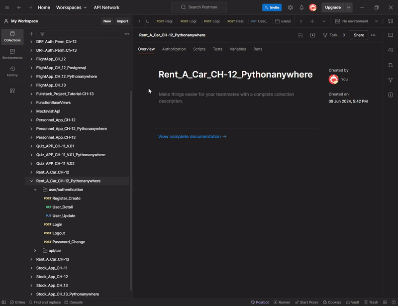
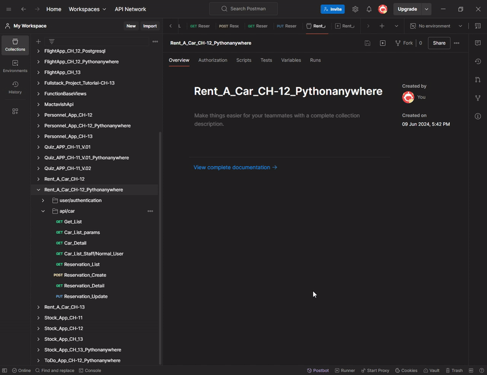

<!-- Please update value in the {}  -->
<p align="center">
  
  
  
  
</p>

<h1 align="center">🚗 Rent a Car REST API</h1>

<p align="center">
A role-based Rent a Car REST API built with Django REST Framework, featuring reservations, availability rules and authentication.
</p>


<div align="center">
  <h3>
    <a href="http://umit8104.pythonanywhere.com/">
      🖥️ Live Demo
    </a>
     | 
    <a href="https://github.com/Umit8098/Project_Django_Rest_Framework_Rent_A_Car_App_CH-12.git">
      📂 Project
    </a>
 
  </h3>
</div>

<!-- TABLE OF CONTENTS -->

## Navigation

- [API Endpoints](#api-endpoints)
  - [User/Authentication Endpoints:](#userauthentication-endpoints)
  - [API/CAR Endpoints:](#apicar-endpoints)
- [API Testing](#api-testing)
- [Overview](#overview)
  - [User Authentication Test](#user-authentication-test)
  - [Rent\_A\_Car\_App CRUD Test](#rent_a_car_app-crud-test)
- [Built With](#built-with)
- [How To Use](#how-to-use)
  - [Example Usage](#example-usage)
- [About This Project](#about-this-project)
- [Key Features](#key-features)
- [Contact](#contact)


## API Endpoints

 All endpoints are protected with authentication where required.


### User/Authentication Endpoints:

| Method | URL                       | Explanation           |
|--------|---------------------------|-----------------------|
| POST   | `/users/register/`        | New user registration |
| POST   | `/users/auth/login/`      | User login            |
| POST   | `/users/auth/logout/`     | User logout           |


### API/CAR Endpoints:

| Method | URL                  | Explanation              |
|--------|----------------------|--------------------------|
| GET    | `/api/car/`          | All vehicles list        |
| POST   | `/api/reservation/`  | Create new reservation   |
| GET    | `/api/reservation/1` | Specific booking details |
| PUT    | `/api/reservation/1` | Update reservation       |
| DELETE | `/api/reservation/1` | Delete reservation       |


## API Testing

Postman Collection contains the necessary requests to test each endpoint of your API. You can use it to quickly understand the functionality of the API.

To test APIs via Postman, you can follow the steps below:

1. Install Postman (if not installed): [Download Postman](https://www.postman.com/downloads/).
2. This [Postman Collection](https://umit-dev.postman.co/workspace/Team-Workspace~7e9925db-bf34-4ab9-802e-6deb333b7a46/collection/17531143-7e6a0325-086d-4ed1-bd4d-d46131a26b88?action=share&creator=17531143) download and import.
3. Start testing APIs via Postman.

**Postman Collection Link:**  
[Rent_A_Car App API Postman Collection](https://umit-dev.postman.co/workspace/Team-Workspace~7e9925db-bf34-4ab9-802e-6deb333b7a46/collection/17531143-7e6a0325-086d-4ed1-bd4d-d46131a26b88?action=share&creator=17531143)


## Overview

Rent A Car API application is a system that aims to facilitate car rental processes. Features of the application:
- Customers:
  - Can list and reserve suitable vehicles for certain date ranges.
  - Can view or cancel their reservations.
  - Cannot rent more than one vehicle within the same date range.
- Managers:
  - The tool can perform CRUD operations for customer and reservation tables.
- Past dates are not listed and reserved vehicles cannot be booked again.


### User Authentication Test
<!--  -->


➡ Testing user authentication processes with Postman.

---

### Rent_A_Car_App CRUD Test
<!--  -->


➡ Testing CRUD operations on the Rent_A_Car_App API with Postman.


## Built With

<!-- This section should list any major frameworks that you built your project using. Here are a few examples.-->
This project is built with the following tools and libraries:

- [Django Rest Framework](https://www.django-rest-framework.org/) - A powerful framework for developing REST APIs.
- [dj-rest-auth](https://dj-rest-auth.readthedocs.io/en/latest/) - User authentication and authorization.
- [django-filter](https://django-filter.readthedocs.io/en/stable/) - To facilitate data filtering operations.

## How To Use

<!-- This is an example, please update according to your application -->

To clone and run this application, you'll need [Git](https://github.com/Umit8098/Project_Django_Rest_Framework_Rent_A_Car_App_CH-12) 

When installing the required packages in the requirements.txt file, review the package differences for windows/macOS/Linux environments. 

Complete the installation by uncommenting the appropriate package.


```bash
# Clone this repository
$ git clone https://github.com/Umit8098/Project_Django_Rest_Framework_Rent_A_Car_App_CH-12.git

# Install dependencies
    $ python -m venv env
    $ python -m venv env (for macOs/linux OS)
    $ env/Scripts/activate (for win OS)
    $ source env/bin/activate (for macOs/linux OS)
    $ pip install -r requirements.txt
    $ python manage.py migrate (for win OS)
    $ python3 manage.py migrate (for macOs/linux OS)

# Create and Edit .env
# Add Your SECRET_KEY in .env file

"""
# example .env;

SECRET_KEY =123456789abcdefg...
"""

# Run the app
    $ python manage.py runserver
```

- After cloning the app and installing the dependencies, you can follow these steps:

### Example Usage

1. **Login Request:**
   - URL: `https://umit8104.pythonanywhere.com/users/auth/login/`
   - Method: `POST`
   - Body (JSON):
```json
  {
    "email": "mary@gmail.com",
    "password": "mary123456"
  }
```

1. **Create Reservation:**
   - URL: `https://umit8104.pythonanywhere.com/api/reservation/`
   - Method: `POST`
   - Headers:
  
```text
  Authorization: Token <token key returned when logged in>
```
- 
  - Body (JSON):

```json
  {
    "customer": 1,
    "car": 2,
    "start_date": "2025-05-26",
    "end_date": "2025-05-28"
}
```

## About This Project

- It is an API application developed to digitize and optimize car rental processes. It offers special capabilities to both customers and managers:
- Customers:
  - Can specify a date range and list available vehicles. Past dates are not listed.
  - A vehicle can be reserved within the selected date range, but a second vehicle cannot be rented within the same date range.
  - A reserved vehicle cannot be reserved on those dates.
  - Can list reservations.
  - Can delete reservations.
- Managers:
  - Car table CRUD operations
  - Customer (User) table CRUD operations
  - Reservation table CRUD operations


## Key Features

- 🚗 **Vehicle Reservation:** Customers can view available vehicles and make reservations within specified date ranges.
- 🚫 **No Overlapping Reservations:** Customers cannot reserve multiple vehicles during the same time period.
- 🔄 **Reservation Management:** Customers can view, cancel, and manage their reservations.
- 🛠️ **Admin CRUD Operations:** Managers can perform CRUD (Create, Read, Update, Delete) operations on vehicles, customers, and reservations.
- 📅 **Future Reservations Only:** The app prevents reservations for past dates and avoids re-booking reserved vehicles.
- 🛡️ **User Authentication:** Users must register and authenticate to access vehicle rental features and manage their reservations.


## Contact

<!-- - Website [your-website.com](https://{your-web-site-link}) -->
- **GitHub** [@Umit8098](https://github.com/Umit8098)

- **LinkedIn** [@umit-arat](https://linkedin.com/in/umit-arat/)
<!-- - Twitter [@your-twitter](https://{twitter.com/your-username}) -->
